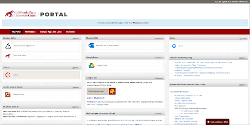
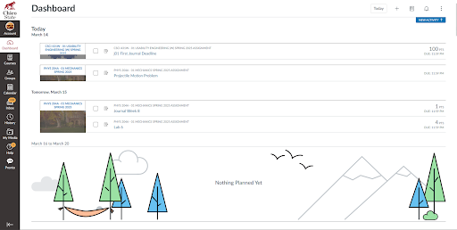
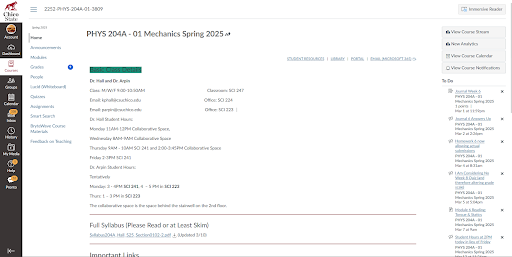
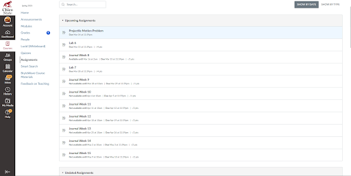

# Hunting For Assignments

By: Vernon Earwood March 15, 2025
One day, I was sitting in my chair relaxing, waiting for an update to finish on my phone then I realized I hadn’t checked all my assignments due to my physics class. In a quick panic, I got to my school's website as well as all I know and love, Chico Portal, to start searching for all my assignments.
 
 

## Goal: 
My goal was simple: find all my upcoming Physics assignments, so I could submit all my assignments before their designated due date. 
Once I logged into my portal, I noticed that the main website lines up a lot with “Aesthetic and Minimalist Design” from [10 Usability Heuristics for User Interface Design](https://www.nngroup.com/articles/ten-usability-heuristics/). As in, it was very easy to read, with the page being clear and concise with a lot of **visual affordances**(which are visual cues that suggest how the user interacts with it), such as the links and buttons that suggest they will go to another page if clicked on. 
Clicking on the one that said Canvas, which I have been trained to do since the first semester here, brought me up to a bunch of assignments from a bunch of different classes. 
Luckily, to my surprise, physics was one of the first classes on the list, but there were only a few assignments.

Due to my **mental model** (how you expect a website or system to work) of how early websites worked, I noticed that the names of the classes were blue. Which blue names in the past allows meant links, so I clicked on the name of the class on the right of the assignment and, to my very little surprise, it took me to the page which my physics class was on.  

When I got to my physics class page, my **cognitive load** (the amount of mental effort needed to do a process) increased exponentially. Due to the clutteredness of the website and the seeming randomness of the sidebar. Even in this mess of a page I was able to spot of the corner of my eye the assignments link on the page. 

Now, after all that time, going through link after link and the clutteredness of the final page, I was able to do **task completion** (which measures whether a user can complete their goals when interacting with an object). Even though I was able to finally complete my task, the task was not easy. With fewer links there would be better **efficiency** (how quickly you can complete your task) within this website.
